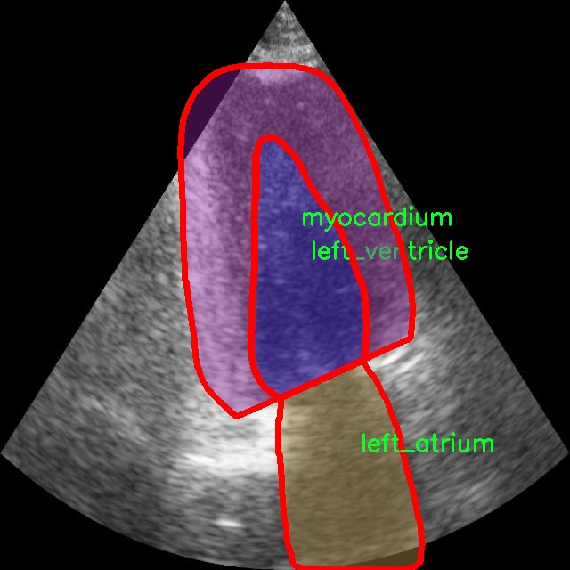

# 彩超心脏结构图像分割系统： yolov8-seg-goldyolo

### 1.研究背景与意义

[参考博客](https://gitee.com/YOLOv8_YOLOv11_Segmentation_Studio/projects)

[博客来源](https://kdocs.cn/l/cszuIiCKVNis)

研究背景与意义

心脏疾病是全球范围内导致死亡的主要原因之一，早期的诊断和有效的治疗对于提高患者的生存率至关重要。超声心动图（彩超）作为一种无创、实时的影像学检查手段，广泛应用于心脏疾病的诊断与评估。通过对心脏结构的精确分割，医生能够更好地理解心脏的功能状态，制定个性化的治疗方案。然而，传统的手动分割方法不仅耗时，而且容易受到操作者主观因素的影响，导致分割结果的不一致性。因此，开发一种高效、准确的自动化心脏结构图像分割系统显得尤为重要。

近年来，深度学习技术的迅猛发展为医学图像处理带来了新的机遇。YOLO（You Only Look Once）系列模型因其高效的实时目标检测能力，逐渐被应用于医学图像分析中。YOLOv8作为该系列的最新版本，结合了多种先进的网络结构和算法，具有更强的特征提取能力和更快的处理速度。通过对YOLOv8进行改进，能够进一步提升其在心脏结构图像分割任务中的表现。特别是在处理复杂的心脏结构时，改进后的YOLOv8模型能够更好地捕捉到不同心脏部位的细微特征，从而实现更高精度的分割。

本研究所使用的数据集CAMUS包含1800幅彩超图像，涵盖了左心房、左心室和心肌三大类结构。这一数据集的丰富性和多样性为模型的训练和验证提供了坚实的基础。通过对不同心脏结构的实例分割，研究能够深入探讨心脏的解剖特征及其在不同病理状态下的变化。此外，数据集中每一类结构的标注信息为模型的学习提供了明确的目标，有助于提高分割的准确性和鲁棒性。

在医学影像领域，自动化分割系统的开发不仅可以提高诊断效率，还能减少医生的工作负担，降低人为错误的发生率。通过基于改进YOLOv8的彩超心脏结构图像分割系统，能够为临床提供一种可靠的辅助工具，帮助医生更快地获取心脏结构信息，进而做出更为准确的诊断。同时，该系统的推广应用也有助于推动心脏病学研究的发展，为心脏疾病的早期筛查和干预提供数据支持。

综上所述，基于改进YOLOv8的彩超心脏结构图像分割系统的研究不仅具有重要的理论意义，还具备广泛的临床应用前景。通过提高心脏结构分割的自动化水平，能够有效促进心脏疾病的早期诊断和治疗，为改善患者的预后贡献力量。

### 2.图片演示


注意：本项目提供完整的训练源码数据集和训练教程,由于此博客编辑较早,暂不提供权重文件（best.pt）,需要按照6.训练教程进行训练后实现上图效果。

### 3.视频演示

[3.1 视频演示](https://www.bilibili.com/video/BV1iRBkYUErS/)

### 4.数据集信息

##### 4.1 数据集类别数＆类别名

nc: 3
names: ['left_atrium', 'left_ventricle', 'myocardium']


##### 4.2 数据集信息简介

数据集信息展示

在本研究中，我们采用了名为“camus”的数据集，以支持改进YOLOv8-seg的彩超心脏结构图像分割系统的训练与评估。该数据集专注于心脏超声图像的分析，尤其是在左心房、左心室及心肌的分割任务中展现出其独特的价值。通过对这一数据集的深入研究，我们能够有效地提升心脏结构的自动识别和分割能力，从而为临床诊断和治疗提供更为精准的支持。

“camus”数据集包含三种主要类别，分别是左心房（left_atrium）、左心室（left_ventricle）和心肌（myocardium）。这些类别的选择不仅反映了心脏解剖结构的基本组成部分，还强调了在心脏疾病诊断中，这些结构的重要性。左心房和左心室作为心脏的主要腔室，承担着血液的接收与泵送功能，而心肌则是心脏收缩与舒张的关键组织。通过对这些结构的精确分割，医生能够更好地评估心脏的功能状态，识别潜在的病变，进而制定个性化的治疗方案。

在数据集的构建过程中，研究者们通过大量的彩超图像收集和标注，确保了数据的多样性和代表性。这些图像不仅涵盖了不同患者的心脏结构，还考虑了不同的超声成像条件和技术参数，从而提高了模型的泛化能力。此外，数据集中的每一张图像都经过精细的标注，确保了每个类别的边界清晰可辨，为后续的深度学习模型训练提供了坚实的基础。

在使用“camus”数据集进行YOLOv8-seg模型的训练时，我们特别关注了数据增强技术的应用，以进一步提升模型的鲁棒性和准确性。通过对原始图像进行旋转、缩放、翻转等操作，我们能够生成更多的训练样本，从而有效地缓解过拟合问题。这一过程不仅丰富了模型的训练数据，也使得模型在面对真实世界中复杂多变的心脏超声图像时，能够表现出更好的适应性。

在模型评估阶段，我们将采用多种指标来衡量分割效果，包括交并比（IoU）、精确率（Precision）和召回率（Recall）等。这些指标将帮助我们全面了解模型在不同类别上的表现，进而为后续的优化提供指导。此外，我们还计划通过可视化技术，将模型的分割结果与真实标注进行对比，以直观展示模型的性能。

综上所述，“camus”数据集为我们改进YOLOv8-seg的彩超心脏结构图像分割系统提供了宝贵的资源和支持。通过对这一数据集的深入分析与应用，我们期望能够推动心脏超声图像分析技术的发展，为临床医学的进步贡献一份力量。





### 5.项目依赖环境部署教程（零基础手把手教学）

[5.1 环境部署教程链接（零基础手把手教学）](https://www.bilibili.com/video/BV1jG4Ve4E9t/?vd_source=bc9aec86d164b67a7004b996143742dc)


[5.2 安装Python虚拟环境创建和依赖库安装视频教程链接（零基础手把手教学）](https://www.bilibili.com/video/BV1nA4VeYEze/?vd_source=bc9aec86d164b67a7004b996143742dc)

### 6.手把手YOLOV8-seg训练视频教程（零基础手把手教学）

[6.1 手把手YOLOV8-seg训练视频教程（零基础小白有手就能学会）](https://www.bilibili.com/video/BV1cA4VeYETe/?vd_source=bc9aec86d164b67a7004b996143742dc)


按照上面的训练视频教程链接加载项目提供的数据集，运行train.py即可开始训练



     Epoch   gpu_mem       box       obj       cls    labels  img_size
     1/200     0G   0.01576   0.01955  0.007536        22      1280: 100%|██████████| 849/849 [14:42<00:00,  1.04s/it]
               Class     Images     Labels          P          R     mAP@.5 mAP@.5:.95: 100%|██████████| 213/213 [01:14<00:00,  2.87it/s]
                 all       3395      17314      0.994      0.957      0.0957      0.0843

     Epoch   gpu_mem       box       obj       cls    labels  img_size
     2/200     0G   0.01578   0.01923  0.007006        22      1280: 100%|██████████| 849/849 [14:44<00:00,  1.04s/it]
               Class     Images     Labels          P          R     mAP@.5 mAP@.5:.95: 100%|██████████| 213/213 [01:12<00:00,  2.95it/s]
                 all       3395      17314      0.996      0.956      0.0957      0.0845

     Epoch   gpu_mem       box       obj       cls    labels  img_size
     3/200     0G   0.01561    0.0191  0.006895        27      1280: 100%|██████████| 849/849 [10:56<00:00,  1.29it/s]
               Class     Images     Labels          P          R     mAP@.5 mAP@.5:.95: 100%|███████   | 187/213 [00:52<00:00,  4.04it/s]
                 all       3395      17314      0.996      0.957      0.0957      0.0845


### 7.50+种全套YOLOV8-seg创新点加载调参实验视频教程（一键加载写好的改进模型的配置文件）

[7.1 50+种全套YOLOV8-seg创新点加载调参实验视频教程（一键加载写好的改进模型的配置文件）](https://www.bilibili.com/video/BV1Hw4VePEXv/?vd_source=bc9aec86d164b67a7004b996143742dc)

### YOLOV8-seg算法简介

原始YOLOV8-seg算法原理

YOLOv8-seg算法是YOLO系列目标检测算法的最新版本，继承并发展了前几代算法的优点，特别是在图像分割任务中展现出强大的性能。该算法的设计旨在实现高效的目标检测与分割，结合了深度学习的最新技术，采用了创新的网络结构和优化策略，以适应复杂的视觉识别任务。

YOLOv8-seg的网络结构可以分为三个主要部分：Backbone、Neck和Head。Backbone部分负责特征提取，Neck部分用于多尺度特征融合，而Head部分则执行最终的目标检测和分割任务。具体而言，Backbone采用了一系列卷积和反卷积层，利用残差连接和瓶颈结构来提升网络的性能并减少计算量。C2模块作为Backbone的基本构成单元，具有较强的特征提取能力。通过5个CBS模块、4个C2f模块和1个快速空间金字塔池化(SPPF)模块的组合，YOLOv8-seg能够有效提取图像中的多层次特征。

在Neck部分，YOLOv8-seg引入了多尺度特征融合技术，旨在捕捉不同尺度目标的信息。通过将来自Backbone不同阶段的特征图进行融合，算法能够更好地应对各种大小和形状的目标，提高了检测的性能和鲁棒性。这种特征融合不仅增强了网络对小目标的检测能力，还提高了对复杂场景的适应性。

Head部分是YOLOv8-seg的核心，负责最终的目标检测和分割任务。该部分设有多个检测头，以处理不同尺寸的信息。每个检测头由一系列卷积层和反卷积层组成，生成最终的检测结果。在YOLOv8-seg中，检测头采用了解耦结构，这一设计使得分类和定位任务可以并行进行，从而提高了检测的准确性和效率。

YOLOv8-seg在数据预处理方面延续了YOLOv5的策略，采用了马赛克增强、混合增强、空间扰动和颜色扰动等多种增强手段。这些数据增强技术有效提高了模型的泛化能力，使其在面对不同类型的输入数据时，能够保持较高的检测精度。

在骨干网络结构方面，YOLOv8-seg继承了YOLOv5的设计理念，但进行了优化。原有的C3模块被新的C2f模块替换，C2f模块通过引入更多的分支，丰富了梯度回传时的支流。这种设计不仅提高了特征提取的效率，还增强了模型的表达能力。

YOLOv8-seg还采用了FPN-PAN结构来构建特征金字塔，使得多尺度信息之间的融合更加充分。通过这种结构，算法能够有效整合来自不同层次的特征信息，从而提升对复杂场景的理解能力。此外，YOLOv8-seg在标签分配策略上进行了创新，采用了动态标签分配策略，解决了正负样本匹配的问题。这一策略不仅提高了训练的效率，还增强了模型对不同数据集的适应性。

在损失函数的设计上，YOLOv8-seg引入了Varifocal Loss和CIoU Loss等新型损失函数，以优化分类和回归任务的性能。Varifocal Loss通过不对称参数对正负样本进行加权，提升了模型对高质量样本的关注度，进而提高了检测精度。CIoU Loss则在回归任务中引入了更为全面的度量标准，使得模型在定位精度上有了显著提升。

总的来说，YOLOv8-seg算法在目标检测与分割任务中展现出了优越的性能，其高效的特征提取、灵活的网络结构以及创新的损失函数设计，使得该算法在处理复杂视觉任务时，能够保持高效的速度和准确性。随着YOLOv8-seg的不断发展和应用，其在计算机视觉领域的潜力将进一步得到挖掘，为各种实际应用提供更为强大的支持。


### 9.系统功能展示（检测对象为举例，实际内容以本项目数据集为准）

图9.1.系统支持检测结果表格显示

  图9.2.系统支持置信度和IOU阈值手动调节

  图9.3.系统支持自定义加载权重文件best.pt(需要你通过步骤5中训练获得)

  图9.4.系统支持摄像头实时识别

  图9.5.系统支持图片识别

  图9.6.系统支持视频识别

  图9.7.系统支持识别结果文件自动保存

  图9.8.系统支持Excel导出检测结果数据


### 10.50+种全套YOLOV8-seg创新点原理讲解（非科班也可以轻松写刊发刊，V11版本正在科研待更新）

#### 10.1 由于篇幅限制，每个创新点的具体原理讲解就不一一展开，具体见下列网址中的创新点对应子项目的技术原理博客网址【Blog】：


[10.1 50+种全套YOLOV8-seg创新点原理讲解链接](https://gitee.com/qunmasj/good)

#### 10.2 部分改进模块原理讲解(完整的改进原理见上图和技术博客链接)【如果此小节的图加载失败可以通过CSDN或者Github搜索该博客的标题访问原始博客，原始博客图片显示正常】

### YOLOv8模型
YOLOv8模型由Ultralytics团队在YOLOv5模型的基础上，吸收了近两年半来经过实际验证的各种改进，于2023年1月提出。与之前的一些YOLO 系列模型想类似，YOLOv8模型也有多种尺寸，下面以YOLOv8n为例，分析 YOLOv8模型的结构和改进点。YOLOv8模型网络结构如
输入图片的部分，由于发现Mosaic数据增强尽管这有助于提升模型的鲁棒性和泛化性，但是，在一定程度上，也会破坏数据的真实分布，使得模型学习到一些不好的信息。所以YOLOv8模型在训练中的最后10个epoch 停止使用Mosaic数据增强。


在网络结构上，首先主干网络的改变不大，主要是将C3模块替换为了C2f模块，该模块的结构在上图中已示出。C2f模块在C3模块的思路基础上，引入了YOLOv7中 ELAN的思路，引入了更多的跳层连接，这有助于该模块获得更丰富的梯度流信息，而且模型的轻量化得到了保证。依然保留了SPPF，效果不变的同时减少了该模块的执行时间。
在颈部网络中，也是将所有的C3模块更改为C2f模块，同时删除了两处上采样之前的卷积连接层。
在头部网络中，采用了YOLOX中使用的解耦头的思路，两条并行的分支分别提取类别和位置特征。由于分类任务更注重于分析特征图中提取到的特征与已输入图片的部分，由于发现 Mosaic数据增强尽管这有助于提升模型的鲁棒性和泛化性，但是，在一定程度上，也会破坏数据的真实分布，使得模型学习到一些不好的信息。所以YOLOv8模型在训练中的最后10个epoch停止使用Mosaic数据增强。
在网络结构上，首先主干网络的改变不大，主要是将C3模块替换为了C2f模块，该模块的结构在上图中已示出。C2f模块在C3模块的思路基础上，引入了YOLOv7中ELAN的思路，引入了更多的跳层连接，这有助于该模块获得更丰富的梯度流信息，而且模型的轻量化得到了保证。依然保留了SPPF，效果不变的同时减少了该模块的执行时间。
在颈部网络中，也是将所有的C3模块更改为C2f模块，同时删除了两处上采样之前的卷积连接层。
在头部网络中，采用了YOLOX中使用的解耦头的思路，两条并行的分支分别提取类别和位置特征。由于分类任务更注重于分析特征图中提取到的特征与已有类别中的哪一种更为相似，而定位任务更关注边界框与真值框的位置关系，并据此对边界框的坐标进行调整。侧重点的不同使得在使用两个检测头时收敛的速度和预测的精度有所提高。而且使用了无锚框结构，直接预测目标的中心，并使用TAL (Task Alignment Learning，任务对齐学习）来区分正负样本，引入了分类分数和IOU的高次幂乘积作为衡量任务对齐程度的指标，认为同时拥有好的定位和分类评价的在分类和定位损失函数中也引入了这项指标。
在模型的检测结果上，YOLOv8模型也取得了较好的成果，图为官方在coCO数据集上 YOLOv8模型的模型尺寸大小和检测的mAP50-95对比图。mAP50-95指的是IOU的值从50%取到95%，步长为5%，然后算在这些IOU下的mAP的均值。图的 a）图展示了YOLOv8在同尺寸下模型中参数没有较大增加的前提下取得了比其他模型更好的精度，图2-17的b)图展示了YOLOv8比其他YOLO系列模型在同尺寸时，推理速度更快且精度没有太大下降。


### 视觉transformer(ViT)简介
视觉transformer(ViT)最近在各种计算机视觉任务中证明了巨大的成功，并受到了相当多的关注。与卷积神经网络(CNNs)相比，ViT具有更强的全局信息捕获能力和远程交互能力，表现出优于CNNs的准确性，特别是在扩大训练数据大小和模型大小时[An image is worth 16x16 words: Transformers for image recognition at scale,Coatnet]。

尽管ViT在低分辨率和高计算领域取得了巨大成功，但在高分辨率和低计算场景下，ViT仍不如cnn。例如，下图(左)比较了COCO数据集上当前基于cnn和基于vit的一级检测器。基于vit的检测器(160G mac)和基于cnn的检测器(6G mac)之间的效率差距超过一个数量级。这阻碍了在边缘设备的实时高分辨率视觉应用程序上部署ViT。


左图:现有的基于vit的一级检测器在实时目标检测方面仍然不如当前基于cnn的一级检测器，需要的计算量多出一个数量级。本文引入了第一个基于vit的实时对象检测器来弥补这一差距。在COCO上，efficientvit的AP比efficientdet高3.8，而mac较低。与YoloX相比，efficient ViT节省67.2%的计算成本，同时提供更高的AP。

中:随着输入分辨率的增加，计算成本呈二次增长，无法有效处理高分辨率的视觉应用。

右图:高分辨率对图像分割很重要。当输入分辨率从1024x2048降低到512x1024时，MobileNetV2的mIoU减少12% (8.5 mIoU)。在不提高分辨率的情况下，只提高模型尺寸是无法缩小性能差距的。

ViT的根本计算瓶颈是softmax注意模块，其计算成本随输入分辨率的增加呈二次增长。例如，如上图(中)所示，随着输入分辨率的增加，vit- small[Pytorch image models. https://github.com/rwightman/ pytorch-image-models]的计算成本迅速显著大于ResNet-152的计算成本。

解决这个问题的一个直接方法是降低输入分辨率。然而，高分辨率的视觉识别在许多现实世界的计算机视觉应用中是必不可少的，如自动驾驶，医疗图像处理等。当输入分辨率降低时，图像中的小物体和精细细节会消失，导致目标检测和语义分割性能显著下降。

上图(右)显示了在cityscape数据集上不同输入分辨率和宽度乘法器下MobileNetV2的性能。例如，将输入分辨率从1024x2048降低到512x1024会使cityscape的性能降低12% (8.5 mIoU)。即使是3.6倍高的mac，只放大模型尺寸而不增加分辨率也无法弥补这一性能损失。

除了降低分辨率外，另一种代表性的方法是限制softmax注意，方法是将其范围限制在固定大小的局部窗口内[Swin transformer,Swin transformer v2]或降低键/值张量的维数[Pyramid vision transformer,Segformer]。然而，它损害了ViT的非局部注意能力，降低了全局接受域(ViT最重要的优点)，使得ViT与大内核cnn的区别更小[A convnet for the 2020s,Scaling up your kernels to 31x31: Revisiting large kernel design in cnns,Lite pose: Efficient architecture design for 2d human pose estimation]。

本文介绍了一个有效的ViT体系结构，以解决这些挑战。发现没有必要坚持softmax注意力。本文建议用线性注意[Transformers are rnns: Fast autoregressive transformers with linear attention]代替softmax注意。

线性注意的关键好处是，它保持了完整的n 2 n^2n 2
 注意映射，就像softmax注意。同时，它利用矩阵乘法的联想特性，避免显式计算完整的注意映射，同时保持相同的功能。因此，它保持了softmax注意力的全局特征提取能力，且计算复杂度仅为线性。线性注意的另一个关键优点是它避免了softmax，这使得它在移动设备上更有效(下图左)。


左图:线性注意比类似mac下的softmax注意快3.3-4.5倍，这是因为去掉了硬件效率不高的softmax功能。延迟是在Qualcomm Snapdragon 855 CPU和TensorFlow-Lite上测量的。本文增加线性注意的头部数量，以确保它具有与softmax注意相似的mac。

中:然而，如果没有softmax注意中使用的非线性注意评分归一化，线性注意无法有效集中其注意分布，削弱了其局部特征提取能力。后文提供了可视化。

右图:本文用深度卷积增强线性注意，以解决线性注意的局限性。深度卷积可以有效地捕捉局部特征，而线性注意可以专注于捕捉全局信息。增强的线性注意在保持线性注意的效率和简单性的同时，表现出在各种视觉任务上的强大表现(图4)。

然而，直接应用线性注意也有缺点。以往的研究表明线性注意和softmax注意之间存在显著的性能差距(下图中间)。


左:高通骁龙855上的精度和延迟权衡。效率vit比效率网快3倍，精度更高。中:ImageNet上softmax注意与线性注意的比较。在相同的计算条件下，本文观察到softmax注意与线性注意之间存在显著的精度差距。而深度卷积增强模型后，线性注意的精度有明显提高。

相比之下，softmax注意的精度变化不大。在相同MAC约束下，增强线性注意比增强软最大注意提高了0.3%的精度。右图:与增强的softmax注意相比，增强的线性注意硬件效率更高，随着分辨率的增加，延迟增长更慢。

深入研究线性注意和softmax注意的详细公式，一个关键的区别是线性注意缺乏非线性注意评分归一化方案。这使得线性注意无法有效地将注意力分布集中在局部模式产生的高注意分数上，从而削弱了其局部特征提取能力。

本文认为这是线性注意的主要限制，使其性能不如softmax注意。本文提出了一个简单而有效的解决方案来解决这一限制，同时保持线性注意在低复杂度和低硬件延迟方面的优势。具体来说，本文建议通过在每个FFN层中插入额外的深度卷积来增强线性注意。因此，本文不需要依赖线性注意进行局部特征提取，避免了线性注意在捕捉局部特征方面的不足，并利用了线性注意在捕捉全局特征方面的优势。

本文广泛评估了efficient vit在低计算预算下对各种视觉任务的有效性，包括COCO对象检测、城市景观语义分割和ImageNet分类。本文想要突出高效的主干设计，所以没有包括任何正交的附加技术(例如，知识蒸馏，神经架构搜索)。尽管如此，在COCO val2017上，efficientvit的AP比efficientdet - d1高2.4倍，同时节省27.9%的计算成本。在cityscape上，efficientvit提供了比SegFormer高2.5个mIoU，同时降低了69.6%的计算成本。在ImageNet上，efficientvit在584M mac上实现了79.7%的top1精度，优于efficientnet - b1的精度，同时节省了16.6%的计算成本。

与现有的以减少参数大小或mac为目标的移动ViT模型[Mobile-former,Mobilevit,NASVit]不同，本文的目标是减少移动设备上的延迟。本文的模型不涉及复杂的依赖或硬件低效操作。因此，本文减少的计算成本可以很容易地转化为移动设备上的延迟减少。

在高通骁龙855 CPU上，efficient vit运行速度比efficientnet快3倍，同时提供更高的ImageNet精度。本文的代码和预训练的模型将在出版后向公众发布。

### Efficient Vision Transformer.
提高ViT的效率对于在资源受限的边缘平台上部署ViT至关重要，如手机、物联网设备等。尽管ViT在高计算区域提供了令人印象深刻的性能，但在针对低计算区域时，它通常不如以前高效的cnn[Efficientnet, mobilenetv3,Once for all: Train one network and specialize it for efficient deployment]。为了缩小差距，MobileViT建议结合CNN和ViT的长处，使用transformer将卷积中的局部处理替换为全局处理。MobileFormer提出了在MobileNet和Transformer之间建立双向桥以实现特征融合的并行化。NASViT提出利用神经架构搜索来搜索高效的ViT架构。

这些模型在ImageNet上提供了极具竞争力的准确性和效率的权衡。然而，它们并不适合高分辨率的视觉任务，因为它们仍然依赖于softmax注意力。


在本节中，本文首先回顾了自然语言处理中的线性注意，并讨论了它的优缺点。接下来，本文介绍了一个简单而有效的解决方案来克服线性注意的局限性。最后，给出了efficient vit的详细架构。

 为可学习投影矩阵。Oi表示矩阵O的第i行。Sim(·，·)为相似度函数。

虽然softmax注意力在视觉和NLP方面非常成功，但它并不是唯一的选择。例如，线性注意提出了如下相似度函数:


其中，φ(·)为核函数。在本工作中，本文选择了ReLU作为内核函数，因为它对硬件来说是友好的。当Sim(Q, K) = φ(Q)φ(K)T时，式(1)可改写为:


线性注意的一个关键优点是，它允许利用矩阵乘法的结合律，在不改变功能的情况下，将计算复杂度从二次型降低到线性型:


除了线性复杂度之外，线性注意的另一个关键优点是它不涉及注意模块中的softmax。Softmax在硬件上效率非常低。避免它可以显著减少延迟。例如，下图(左)显示了softmax注意和线性注意之间的延迟比较。在类似的mac上，线性注意力比移动设备上的softmax注意力要快得多。


#### EfficientViT
Enhancing Linear Attention with Depthwise Convolution

虽然线性注意在计算复杂度和硬件延迟方面优于softmax注意，但线性注意也有局限性。以往的研究[\[Luna: Linear unified nested attention,Random feature attention,Combiner: Full attention transformer with sparse computation cost,cosformer: Rethinking softmax in attention\]](https://afdian.net/item/602b9612927111ee9ec55254001e7c00)表明，在NLP中线性注意和softmax注意之间通常存在显著的性能差距。对于视觉任务，之前的研究[Visual correspondence hallucination,Quadtree attention for vision transformers]也表明线性注意不如softmax注意。在本文的实验中，本文也有类似的观察结果(图中)。


本文对这一假设提出了质疑，认为线性注意的低劣性能主要是由于局部特征提取能力的丧失。如果没有在softmax注意中使用的非线性评分归一化，线性注意很难像softmax注意那样集中其注意分布。下图(中间)提供了这种差异的示例。


在相同的原始注意力得分下，使用softmax比不使用softmax更能集中注意力。因此，线性注意不能有效地聚焦于局部模式产生的高注意分数(下图)，削弱了其局部特征提取能力。


注意图的可视化显示了线性注意的局限性。通过非线性注意归一化，softmax注意可以产生清晰的注意分布，如中间行所示。相比之下，线性注意的分布相对平滑，使得线性注意在捕捉局部细节方面的能力较弱，造成了显著的精度损失。本文通过深度卷积增强线性注意来解决这一限制，并有效提高了准确性。

介绍了一个简单而有效的解决方案来解决这个限制。本文的想法是用卷积增强线性注意，这在局部特征提取中是非常有效的。这样，本文就不需要依赖于线性注意来捕捉局部特征，而可以专注于全局特征提取。具体来说，为了保持线性注意的效率和简单性，本文建议在每个FFN层中插入一个深度卷积，这样计算开销很小，同时极大地提高了线性注意的局部特征提取能力。

#### Building Block

下图(右)展示了增强线性注意的详细架构，它包括一个线性注意层和一个FFN层，在FFN的中间插入深度卷积。


与之前的方法[Swin transformer,Coatnet]不同，本文在efficientvit中没有使用相对位置偏差。相对位置偏差虽然可以改善模型的性能，但它使模型容易受到分辨率变化[Segformer]的影响。多分辨率训练或新分辨率下的测试在检测和分割中很常见。去除相对位置偏差使高效率vit对输入分辨率更加灵活。

与之前低计算CNNs[Mobilenetv2,mobilenetv3]的设计不同，本文为下采样块添加了额外的下采样快捷方式。每个下采样快捷方式由一个平均池和一个1x1卷积组成。在本文的实验中，这些额外的下采样快捷方式可以稳定训练效率，提高性能。

#### Macro Architecture

下图说明了efficientvit的宏观体系结构。它由输入 stem 和4级组成。最近的研究[Coatnet,Levit,Early convolutions help transformers see better]表明在早期阶段使用卷积对ViT更好。本文遵循这个设计，在第三阶段开始使用增强的线性注意。


EfficientViT宏观架构。本文从第三阶段开始使用增强的线性注意。P2、P3和P4形成了一个金字塔特征图，用于检测和分割。P4用于分类。

为了突出高效的主干本身，本文对MBConv和FFN使用相同的扩展比e (e = 4)保持超参数简单，对所有深度卷积使用相同的内核大小k(除了输入stem)，对所有层使用相同的激活函数(hard swish)。

P2、P3和P4表示阶段2、3和4的输出，形成了特征图的金字塔。本文按照惯例将P2、P3和P4送至检测头。本文使用Yolov8进行检测。为了分割，本文融合了P2和P4。融合特征被馈送到一个轻量级头，包括几个卷积层，遵循Fast-SCNN。为了分类，本文将P4输入到轻量级头部，与MobileNetV3相同。


### 11.项目核心源码讲解（再也不用担心看不懂代码逻辑）

#### 11.1 ultralytics\solutions\__init__.py

以下是代码的核心部分，并附上详细的中文注释：

```python
# Ultralytics YOLO 🚀, AGPL-3.0 license

# 这是一个用于目标检测的YOLO（You Only Look Once）模型的实现
# YOLO是一种实时目标检测系统，能够在图像中快速识别和定位多个对象

# 主要功能包括：
# 1. 加载预训练模型
# 2. 处理输入图像
# 3. 进行目标检测
# 4. 输出检测结果

# 加载YOLO模型
def load_model(model_path):
    """
    加载YOLO模型
    :param model_path: 模型文件的路径
    :return: 加载的模型
    """
    # 使用Ultralytics库加载模型
    model = YOLO(model_path)
    return model

# 进行目标检测
def detect_objects(model, image):
    """
    使用YOLO模型进行目标检测
    :param model: 加载的YOLO模型
    :param image: 输入图像
    :return: 检测到的对象及其位置
    """
    # 使用模型对输入图像进行推理
    results = model(image)
    return results

# 输出检测结果
def output_results(results):
    """
    输出检测结果
    :param results: 检测结果
    """
    # 遍历检测结果并打印每个对象的类别和置信度
    for result in results:
        print(f"检测到对象: {result['label']}, 置信度: {result['confidence']:.2f}")

# 主程序入口
if __name__ == "__main__":
    # 指定模型路径和输入图像
    model_path = 'path/to/yolo/model.pt'
    image_path = 'path/to/input/image.jpg'
    
    # 加载模型
    model = load_model(model_path)
    
    # 读取输入图像
    image = load_image(image_path)
    
    # 进行目标检测
    results = detect_objects(model, image)
    
    # 输出检测结果
    output_results(results)
```

### 注释说明：
1. **加载模型**：定义了一个函数来加载YOLO模型，输入为模型文件的路径，返回加载后的模型对象。
2. **目标检测**：定义了一个函数来对输入图像进行目标检测，返回检测结果。
3. **输出结果**：定义了一个函数来输出检测到的对象及其置信度。
4. **主程序入口**：包含了程序的主逻辑，加载模型、读取图像、进行检测并输出结果。

这些部分构成了YOLO目标检测的基本流程。

这个程序文件的文件名是 `__init__.py`，位于 `ultralytics/solutions` 目录下。根据文件的名称和路径，可以推测这是一个 Python 包的初始化文件。`__init__.py` 文件的主要作用是将包含它的目录标识为一个 Python 包，从而使得该目录下的模块可以被导入。

文件开头的注释 `# Ultralytics YOLO 🚀, AGPL-3.0 license` 表示这个包与 Ultralytics YOLO 相关，YOLO 是一种流行的目标检测算法。注释中提到的 AGPL-3.0 许可证是一种开源许可证，允许用户自由使用、修改和分发软件，但要求在分发时也要开放源代码。

虽然这个文件的代码非常简单，仅包含一行注释，但它的存在对于整个包的结构和功能是至关重要的。通过这个文件，Python 解释器能够识别 `ultralytics.solutions` 这个模块，从而使得开发者可以方便地使用其中定义的功能和类。

总的来说，这个 `__init__.py` 文件在 Python 包的组织中起到了基础性作用，虽然内容简单，但它是确保包结构正常运作的关键部分。

#### 11.2 ultralytics\engine\predictor.py

以下是代码中最核心的部分，并附上详细的中文注释：

```python
class BasePredictor:
    """
    BasePredictor类。

    这是一个用于创建预测器的基类。

    属性:
        args (SimpleNamespace): 预测器的配置。
        save_dir (Path): 保存结果的目录。
        done_warmup (bool): 预测器是否完成初始化。
        model (nn.Module): 用于预测的模型。
        data (dict): 数据配置。
        device (torch.device): 用于预测的设备。
        dataset (Dataset): 用于预测的数据集。
    """

    def __init__(self, cfg=DEFAULT_CFG, overrides=None, _callbacks=None):
        """
        初始化BasePredictor类。

        参数:
            cfg (str, optional): 配置文件的路径。默认为DEFAULT_CFG。
            overrides (dict, optional): 配置覆盖。默认为None。
        """
        self.args = get_cfg(cfg, overrides)  # 获取配置
        self.save_dir = get_save_dir(self.args)  # 获取保存目录
        if self.args.conf is None:
            self.args.conf = 0.25  # 默认置信度为0.25
        self.done_warmup = False  # 初始化状态
        self.model = None  # 模型初始化为None
        self.data = self.args.data  # 数据配置
        self.imgsz = None  # 图像大小
        self.device = None  # 设备
        self.dataset = None  # 数据集
        self.results = None  # 预测结果
        self.callbacks = _callbacks or callbacks.get_default_callbacks()  # 回调函数

    def preprocess(self, im):
        """
        在推理之前准备输入图像。

        参数:
            im (torch.Tensor | List(np.ndarray)): 输入图像，可以是张量或图像列表。
        
        返回:
            torch.Tensor: 处理后的图像张量。
        """
        not_tensor = not isinstance(im, torch.Tensor)  # 检查输入是否为张量
        if not_tensor:
            im = np.stack(self.pre_transform(im))  # 预处理图像
            im = im[..., ::-1].transpose((0, 3, 1, 2))  # BGR转RGB，维度调整
            im = np.ascontiguousarray(im)  # 确保数组是连续的
            im = torch.from_numpy(im)  # 转换为张量

        im = im.to(self.device)  # 移动到指定设备
        im = im.half() if self.model.fp16 else im.float()  # 转换数据类型
        if not_tensor:
            im /= 255  # 归一化到0.0 - 1.0
        return im

    def inference(self, im, *args, **kwargs):
        """对给定图像运行推理。"""
        return self.model(im, augment=self.args.augment)  # 使用模型进行推理

    def stream_inference(self, source=None, model=None, *args, **kwargs):
        """在摄像头输入上进行实时推理并将结果保存到文件。"""
        if not self.model:
            self.setup_model(model)  # 设置模型

        self.setup_source(source if source is not None else self.args.source)  # 设置数据源

        for batch in self.dataset:  # 遍历数据集
            path, im0s, vid_cap, s = batch  # 获取当前批次的数据
            im = self.preprocess(im0s)  # 预处理图像
            preds = self.inference(im, *args, **kwargs)  # 进行推理
            self.results = self.postprocess(preds, im, im0s)  # 后处理结果

            for i in range(len(im0s)):
                self.write_results(i, self.results, (path[i], im, im0s[i]))  # 写入结果

            yield from self.results  # 生成结果

    def setup_model(self, model, verbose=True):
        """使用给定参数初始化YOLO模型并设置为评估模式。"""
        self.model = AutoBackend(model or self.args.model, device=select_device(self.args.device))  # 初始化模型
        self.device = self.model.device  # 更新设备
        self.model.eval()  # 设置为评估模式

    def write_results(self, idx, results, batch):
        """将推理结果写入文件或目录。"""
        p, im, _ = batch  # 获取当前批次的路径和图像
        result = results[idx]  # 获取当前结果
        # 处理保存和显示逻辑
        if self.args.save_txt:
            result.save_txt(f'{self.save_dir}/labels/{p.stem}.txt')  # 保存文本结果
        if self.args.save:
            cv2.imwrite(f'{self.save_dir}/{p.name}', im[idx])  # 保存图像结果
```

### 代码核心部分说明：
1. **BasePredictor类**：这是一个基类，用于创建YOLO模型的预测器，包含了初始化、预处理、推理、后处理等基本功能。
2. **初始化方法**：在初始化时，获取配置、设置保存目录、初始化模型等。
3. **预处理方法**：对输入图像进行处理，确保图像格式和数据类型符合模型要求。
4. **推理方法**：使用模型对预处理后的图像进行推理，得到预测结果。
5. **流式推理方法**：支持实时视频流的推理，并逐帧处理。
6. **模型设置方法**：初始化YOLO模型并设置为评估模式。
7. **结果写入方法**：将推理结果保存到指定的文件或目录中。

这些部分构成了YOLO模型进行推理的基本框架，能够处理不同类型的输入源并输出预测结果。

这个程序文件是Ultralytics YOLO（You Only Look Once）模型的预测器，主要用于在图像、视频、目录、流媒体等多种来源上进行目标检测。文件中包含了许多功能和类，下面是对其主要内容的说明。

首先，文件定义了一个`BasePredictor`类，这是一个用于创建预测器的基类。该类的构造函数初始化了一些重要的属性，包括配置参数、保存结果的目录、模型、数据配置、设备、数据集等。构造函数还处理了一些默认值，例如置信度阈值。

在图像处理方面，`BasePredictor`类提供了`preprocess`方法，用于在推理之前准备输入图像。这个方法会将输入图像转换为张量，并根据模型的要求进行格式转换和归一化处理。

`inference`方法用于对给定的图像进行推理，返回模型的预测结果。推理过程中会调用`pre_transform`方法，对输入图像进行预处理，包括调整图像大小和格式。

`write_results`方法负责将推理结果写入文件或目录，并可选择将检测框绘制到图像上。该方法会生成日志字符串，记录处理的图像信息和检测结果。

在推理的主流程中，`__call__`方法会根据输入的源和模型执行推理。如果是流媒体，则调用`stream_inference`方法进行实时推理。`setup_source`方法用于设置输入源并检查图像大小等参数。

`stream_inference`方法是该类的核心，负责处理实时推理的逻辑。它会循环处理数据集中的每一批图像，进行预处理、推理和后处理，并在每个批次结束时调用相应的回调函数。该方法还会记录每个步骤的时间，方便性能分析。

此外，`setup_model`方法用于初始化YOLO模型并设置为评估模式。`show`方法用于使用OpenCV显示图像，`save_preds`方法则负责将预测结果保存为视频文件。

文件中还包含了一些警告信息和日志记录，帮助用户了解推理过程中的状态和潜在问题，例如内存使用情况和结果保存情况。

总的来说，这个文件实现了YOLO模型的预测功能，提供了灵活的输入源支持和多种输出选项，适用于各种计算机视觉任务。

#### 11.3 ultralytics\data\converter.py

以下是代码中最核心的部分，并附上详细的中文注释：

```python
def coco91_to_coco80_class():
    """
    将91个COCO类ID转换为80个COCO类ID。

    返回:
        (list): 一个包含91个类ID的列表，其中索引表示80个类ID，值为对应的91个类ID。
    """
    return [
        0, 1, 2, 3, 4, 5, 6, 7, 8, 9, 10, None, 11, 12, 13, 14, 15, 16, 17, 18, 19, 20, 21, 22, 23, None, 24, 25, None,
        None, 26, 27, 28, 29, 30, 31, 32, 33, 34, 35, 36, 37, 38, 39, None, 40, 41, 42, 43, 44, 45, 46, 47, 48, 49, 50,
        51, 52, 53, 54, 55, 56, 57, 58, 59, None, 60, None, None, 61, None, 62, 63, 64, 65, 66, 67, 68, 69, 70, 71, 72,
        None, 73, 74, 75, 76, 77, 78, 79, None]

def convert_coco(labels_dir='../coco/annotations/',
                 save_dir='coco_converted/',
                 use_segments=False,
                 use_keypoints=False,
                 cls91to80=True):
    """
    将COCO数据集的注释转换为适合训练YOLO模型的YOLO注释格式。

    参数:
        labels_dir (str, optional): 包含COCO数据集注释文件的目录路径。
        save_dir (str, optional): 保存结果的目录路径。
        use_segments (bool, optional): 是否在输出中包含分割掩码。
        use_keypoints (bool, optional): 是否在输出中包含关键点注释。
        cls91to80 (bool, optional): 是否将91个COCO类ID映射到对应的80个COCO类ID。

    输出:
        在指定的输出目录中生成输出文件。
    """

    # 创建数据集目录
    save_dir = increment_path(save_dir)  # 如果保存目录已存在，则增加后缀
    for p in save_dir / 'labels', save_dir / 'images':
        p.mkdir(parents=True, exist_ok=True)  # 创建目录

    # 转换类
    coco80 = coco91_to_coco80_class()  # 获取80类的映射

    # 导入json
    for json_file in sorted(Path(labels_dir).resolve().glob('*.json')):
        fn = Path(save_dir) / 'labels' / json_file.stem.replace('instances_', '')  # 文件夹名称
        fn.mkdir(parents=True, exist_ok=True)
        with open(json_file) as f:
            data = json.load(f)  # 读取json文件

        # 创建图像字典
        images = {f'{x["id"]:d}': x for x in data['images']}
        # 创建图像-注释字典
        imgToAnns = defaultdict(list)
        for ann in data['annotations']:
            imgToAnns[ann['image_id']].append(ann)

        # 写入标签文件
        for img_id, anns in TQDM(imgToAnns.items(), desc=f'Annotations {json_file}'):
            img = images[f'{img_id:d}']
            h, w, f = img['height'], img['width'], img['file_name']

            bboxes = []  # 存储边界框
            segments = []  # 存储分割
            keypoints = []  # 存储关键点
            for ann in anns:
                if ann['iscrowd']:
                    continue  # 跳过人群注释
                # COCO框格式为 [左上角x, 左上角y, 宽度, 高度]
                box = np.array(ann['bbox'], dtype=np.float64)
                box[:2] += box[2:] / 2  # 将左上角坐标转换为中心坐标
                box[[0, 2]] /= w  # 归一化x坐标
                box[[1, 3]] /= h  # 归一化y坐标
                if box[2] <= 0 or box[3] <= 0:  # 如果宽度或高度小于等于0
                    continue

                cls = coco80[ann['category_id'] - 1] if cls91to80 else ann['category_id'] - 1  # 类别
                box = [cls] + box.tolist()  # 将类别和边界框合并
                if box not in bboxes:
                    bboxes.append(box)  # 添加边界框
                if use_segments and ann.get('segmentation') is not None:
                    # 处理分割
                    if len(ann['segmentation']) == 0:
                        segments.append([])
                        continue
                    elif len(ann['segmentation']) > 1:
                        s = merge_multi_segment(ann['segmentation'])  # 合并多个分割
                        s = (np.concatenate(s, axis=0) / np.array([w, h])).reshape(-1).tolist()
                    else:
                        s = [j for i in ann['segmentation'] for j in i]  # 所有分割连接
                        s = (np.array(s).reshape(-1, 2) / np.array([w, h])).reshape(-1).tolist()
                    s = [cls] + s
                    if s not in segments:
                        segments.append(s)  # 添加分割
                if use_keypoints and ann.get('keypoints') is not None:
                    keypoints.append(box + (np.array(ann['keypoints']).reshape(-1, 3) /
                                            np.array([w, h, 1])).reshape(-1).tolist())

            # 写入文件
            with open((fn / f).with_suffix('.txt'), 'a') as file:
                for i in range(len(bboxes)):
                    if use_keypoints:
                        line = *(keypoints[i]),  # 类别, 边界框, 关键点
                    else:
                        line = *(segments[i]
                                 if use_segments and len(segments[i]) > 0 else bboxes[i]),  # 类别, 边界框或分割
                    file.write(('%g ' * len(line)).rstrip() % line + '\n')  # 写入行

    LOGGER.info(f'COCO数据成功转换。\n结果保存到 {save_dir.resolve()}')
```

### 代码说明：
1. **coco91_to_coco80_class**: 该函数用于将COCO数据集中91个类的ID转换为80个类的ID，并返回一个列表，列表的索引对应80个类的ID，值为对应的91个类的ID。

2. **convert_coco**: 该函数将COCO数据集的注释转换为YOLO格式。它接受多个参数以控制转换的细节，如是否使用分割、关键点以及是否进行类ID的转换。函数会创建保存结果的目录，读取COCO的JSON注释文件，解析图像和注释信息，并将其转换为YOLO格式的文本文件。

3. **边界框处理**: 在转换过程中，函数会对每个注释进行处理，包括将COCO的边界框格式转换为YOLO格式，归一化坐标，并处理分割和关键点信息。

4. **写入文件**: 最后，函数将转换后的数据写入到指定的文本文件中，格式符合YOLO的要求。

通过以上的注释和说明，可以清晰地理解代码的核心功能和实现逻辑。

这个程序文件 `ultralytics\data\converter.py` 主要用于将 COCO 数据集的标注格式转换为 YOLO 模型所需的标注格式。文件中包含多个函数，下面对其功能进行逐一说明。

首先，文件导入了一些必要的库，包括 `json`、`defaultdict`、`Path`、`cv2` 和 `numpy`，并且从 `ultralytics.utils` 中导入了一些工具函数和日志记录器。

文件中定义了两个函数 `coco91_to_coco80_class` 和 `coco80_to_coco91_class`，它们分别用于将 COCO 数据集中的 91 类标识符转换为 80 类标识符，以及反向转换。这是因为 COCO 数据集中有 91 个类别，但在某些情况下（如 YOLO），只需要使用其中的 80 个类别。

接下来是 `convert_coco` 函数，这是该文件的核心功能。该函数接受多个参数，包括标注文件的目录、保存结果的目录、是否使用分割掩码、是否使用关键点标注，以及是否将 91 类标识符映射到 80 类标识符。函数的主要步骤包括创建保存目录、读取 COCO 的 JSON 文件、构建图像和标注的字典、处理每个图像的标注并将其转换为 YOLO 格式。转换过程中，程序会根据 COCO 的标注格式将边界框的坐标进行归一化，并将其写入相应的文本文件中。

此外，文件中还定义了 `convert_dota_to_yolo_obb` 函数，用于将 DOTA 数据集的标注转换为 YOLO 的方向边界框格式。该函数处理 DOTA 数据集中的训练和验证图像，读取原始标签并将其转换为 YOLO 格式。函数内部定义了一个 `convert_label` 的辅助函数，用于处理单个图像的标签转换。

文件还包含一些辅助函数，如 `min_index` 用于查找两个数组中最短距离的索引对，以及 `merge_multi_segment` 用于合并多个分割区域。这些辅助函数在处理复杂的标注数据时提供了必要的支持。

总体而言，这个程序文件实现了从 COCO 和 DOTA 数据集到 YOLO 格式的标注转换，便于用户使用这些数据集进行 YOLO 模型的训练。通过将不同格式的标注数据进行转换，程序提高了数据集的兼容性和使用效率。

#### 11.4 ultralytics\cfg\__init__.py

以下是经过简化并附有详细中文注释的核心代码部分：

```python
import sys
from pathlib import Path
from types import SimpleNamespace
from typing import Dict, Union

# 定义有效的任务和模式
MODES = 'train', 'val', 'predict', 'export', 'track', 'benchmark'
TASKS = 'detect', 'segment', 'classify', 'pose'

# 任务与数据集、模型、评估指标的映射
TASK2DATA = {
    'detect': 'coco8.yaml',
    'segment': 'coco8-seg.yaml',
    'classify': 'imagenet10',
    'pose': 'coco8-pose.yaml'
}
TASK2MODEL = {
    'detect': 'yolov8n.pt',
    'segment': 'yolov8n-seg.pt',
    'classify': 'yolov8n-cls.pt',
    'pose': 'yolov8n-pose.pt'
}
TASK2METRIC = {
    'detect': 'metrics/mAP50-95(B)',
    'segment': 'metrics/mAP50-95(M)',
    'classify': 'metrics/accuracy_top1',
    'pose': 'metrics/mAP50-95(P)'
}

def cfg2dict(cfg):
    """
    将配置对象转换为字典格式，支持文件路径、字符串或SimpleNamespace对象。

    参数:
        cfg (str | Path | dict | SimpleNamespace): 要转换的配置对象。

    返回:
        cfg (dict): 转换后的字典格式配置对象。
    """
    if isinstance(cfg, (str, Path)):
        cfg = yaml_load(cfg)  # 从文件加载字典
    elif isinstance(cfg, SimpleNamespace):
        cfg = vars(cfg)  # 转换为字典
    return cfg

def get_cfg(cfg: Union[str, Path, Dict, SimpleNamespace], overrides: Dict = None):
    """
    加载并合并配置数据。

    参数:
        cfg (str | Path | Dict | SimpleNamespace): 配置数据。
        overrides (Dict | optional): 覆盖的配置。

    返回:
        (SimpleNamespace): 训练参数的命名空间。
    """
    cfg = cfg2dict(cfg)  # 将配置转换为字典

    # 合并覆盖配置
    if overrides:
        overrides = cfg2dict(overrides)
        cfg = {**cfg, **overrides}  # 合并配置字典

    # 类型和值检查
    for k, v in cfg.items():
        if v is not None:  # 忽略None值
            if k in CFG_FLOAT_KEYS and not isinstance(v, (int, float)):
                raise TypeError(f"'{k}={v}' 的类型无效，必须是 int 或 float。")
            elif k in CFG_INT_KEYS and not isinstance(v, int):
                raise TypeError(f"'{k}={v}' 的类型无效，必须是 int。")
            elif k in CFG_BOOL_KEYS and not isinstance(v, bool):
                raise TypeError(f"'{k}={v}' 的类型无效，必须是 bool。")

    return IterableSimpleNamespace(**cfg)  # 返回命名空间对象

def entrypoint(debug=''):
    """
    该函数是Ultralytics包的入口点，负责解析传递给包的命令行参数。

    参数:
        debug (str): 调试模式下的参数。
    """
    args = (debug.split(' ') if debug else sys.argv)[1:]  # 获取命令行参数
    if not args:  # 如果没有参数
        LOGGER.info(CLI_HELP_MSG)  # 显示帮助信息
        return

    overrides = {}  # 存储覆盖的参数
    for a in args:
        if '=' in a:
            k, v = a.split('=', 1)  # 解析参数
            overrides[k] = v  # 存储覆盖参数
        elif a in TASKS:
            overrides['task'] = a  # 记录任务
        elif a in MODES:
            overrides['mode'] = a  # 记录模式

    # 检查模式和任务的有效性
    mode = overrides.get('mode', 'predict')  # 默认模式为预测
    task = overrides.get('task')

    # 运行相应的模型方法
    model = YOLO(overrides.get('model', 'yolov8n.pt'), task=task)  # 初始化模型
    getattr(model, mode)(**overrides)  # 调用模型的相应方法

if __name__ == '__main__':
    entrypoint()  # 运行入口函数
```

### 代码说明：
1. **导入模块**：导入所需的模块和库，包括系统、路径处理、类型注解等。
2. **定义常量**：定义有效的任务和模式，以及任务与数据集、模型、评估指标的映射关系。
3. **cfg2dict函数**：将配置对象转换为字典格式，支持多种输入类型。
4. **get_cfg函数**：加载并合并配置数据，进行类型和值的检查，返回一个命名空间对象。
5. **entrypoint函数**：程序的入口点，解析命令行参数，处理任务和模式，初始化模型并调用相应的方法。
6. **主程序**：如果脚本被直接运行，则调用入口函数。

这个程序文件是Ultralytics YOLO（You Only Look Once）模型的配置和命令行接口实现。它主要用于处理YOLO模型的训练、验证、预测、导出等任务，并提供了相应的命令行帮助信息。

首先，文件中导入了一些必要的库和模块，包括上下文管理、文件操作、路径处理、类型定义等。接着，定义了一些有效的任务和模式，例如训练（train）、验证（val）、预测（predict）、导出（export）、跟踪（track）和基准测试（benchmark）。同时，定义了不同任务对应的数据集、模型和评估指标。

文件中还包含了一个CLI帮助信息字符串，详细说明了如何使用YOLO命令，包括示例命令，用户可以通过这些命令来训练模型、进行预测、验证等操作。

接下来，定义了一些配置键的类型检查，包括浮点数、整数、布尔值等。通过`cfg2dict`函数，可以将配置对象转换为字典格式，支持文件路径、字符串、字典和SimpleNamespace对象。

`get_cfg`函数用于加载和合并配置数据，可以从文件或字典中读取配置，并支持覆盖默认配置。它还会进行类型和值的检查，确保配置的有效性。

`get_save_dir`函数用于根据训练、验证或预测的参数生成保存目录，确保保存的文件不会覆盖已有的文件。

`_handle_deprecation`函数用于处理过时的配置键，给出警告并进行相应的更新。

`check_dict_alignment`函数检查自定义配置与基础配置之间的键是否匹配，如果发现不匹配的键，会给出相似的有效键的提示。

`merge_equals_args`函数用于合并参数列表中的等号分隔的参数，确保参数格式正确。

`handle_yolo_hub`和`handle_yolo_settings`函数分别处理与Ultralytics HUB相关的命令和YOLO设置相关的命令，允许用户进行登录、登出和设置重置等操作。

`parse_key_value_pair`和`smart_value`函数用于解析命令行参数中的键值对，并将字符串转换为相应的类型。

`entrypoint`函数是程序的入口点，负责解析命令行参数并调用相应的功能。它处理了各种任务和模式的输入，确保用户输入的参数符合要求，并最终调用模型的相应方法进行操作。

最后，文件还定义了一个`copy_default_cfg`函数，用于复制默认配置文件，以便用户进行自定义配置。

整个文件的设计使得用户可以方便地通过命令行与YOLO模型进行交互，进行各种机器学习任务的配置和执行。

### 12.系统整体结构（节选）

### 程序整体功能和构架概括

该程序是Ultralytics YOLO（You Only Look Once）目标检测模型的实现，主要用于目标检测任务的训练、推理和数据处理。程序的整体架构由多个模块组成，每个模块负责特定的功能，确保整个系统的高效性和可扩展性。

1. **数据处理**：`converter.py` 模块负责将不同格式的数据集（如 COCO 和 DOTA）转换为 YOLO 所需的标注格式，便于模型训练和评估。
2. **推理引擎**：`predictor.py` 模块实现了目标检测的推理功能，支持多种输入源（如图像、视频、流媒体），并提供了实时推理和结果保存的功能。
3. **配置管理**：`__init__.py` 和 `cfg\__init__.py` 模块负责管理模型的配置和命令行接口，允许用户通过命令行灵活地设置训练和推理参数。
4. **包初始化**：`solutions\__init__.py` 模块作为包的初始化文件，确保整个包的结构完整性。

### 文件功能整理表

| 文件路径                                   | 功能描述                                                                                      |
|--------------------------------------------|-----------------------------------------------------------------------------------------------|
| `ultralytics/solutions/__init__.py`       | 包的初始化文件，标识该目录为一个 Python 包，确保模块可以被导入。                              |
| `ultralytics/engine/predictor.py`         | 实现目标检测的推理功能，支持多种输入源，提供实时推理、结果保存和日志记录等功能。              |
| `ultralytics/data/converter.py`           | 将 COCO 和 DOTA 数据集的标注格式转换为 YOLO 所需的格式，便于模型训练和评估。                  |
| `ultralytics/cfg/__init__.py`             | 管理模型的配置和命令行接口，提供配置加载、参数解析和命令行帮助信息，支持模型训练和推理。      |
| `ultralytics/__init__.py`                 | （假设存在）可能用于初始化整个 Ultralytics 包，包含基础设置和导入必要的模块。                  |

这个表格总结了每个文件的主要功能，帮助理解整个程序的架构和模块间的关系。

### 13.图片、视频、摄像头图像分割Demo(去除WebUI)代码

在这个博客小节中，我们将讨论如何在不使用WebUI的情况下，实现图像分割模型的使用。本项目代码已经优化整合，方便用户将分割功能嵌入自己的项目中。
核心功能包括图片、视频、摄像头图像的分割，ROI区域的轮廓提取、类别分类、周长计算、面积计算、圆度计算以及颜色提取等。
这些功能提供了良好的二次开发基础。

### 核心代码解读

以下是主要代码片段，我们会为每一块代码进行详细的批注解释：

```python
import random
import cv2
import numpy as np
from PIL import ImageFont, ImageDraw, Image
from hashlib import md5
from model import Web_Detector
from chinese_name_list import Label_list

# 根据名称生成颜色
def generate_color_based_on_name(name):
    ......

# 计算多边形面积
def calculate_polygon_area(points):
    return cv2.contourArea(points.astype(np.float32))

...
# 绘制中文标签
def draw_with_chinese(image, text, position, font_size=20, color=(255, 0, 0)):
    image_pil = Image.fromarray(cv2.cvtColor(image, cv2.COLOR_BGR2RGB))
    draw = ImageDraw.Draw(image_pil)
    font = ImageFont.truetype("simsun.ttc", font_size, encoding="unic")
    draw.text(position, text, font=font, fill=color)
    return cv2.cvtColor(np.array(image_pil), cv2.COLOR_RGB2BGR)

# 动态调整参数
def adjust_parameter(image_size, base_size=1000):
    max_size = max(image_size)
    return max_size / base_size

# 绘制检测结果
def draw_detections(image, info, alpha=0.2):
    name, bbox, conf, cls_id, mask = info['class_name'], info['bbox'], info['score'], info['class_id'], info['mask']
    adjust_param = adjust_parameter(image.shape[:2])
    spacing = int(20 * adjust_param)

    if mask is None:
        x1, y1, x2, y2 = bbox
        aim_frame_area = (x2 - x1) * (y2 - y1)
        cv2.rectangle(image, (x1, y1), (x2, y2), color=(0, 0, 255), thickness=int(3 * adjust_param))
        image = draw_with_chinese(image, name, (x1, y1 - int(30 * adjust_param)), font_size=int(35 * adjust_param))
        y_offset = int(50 * adjust_param)  # 类别名称上方绘制，其下方留出空间
    else:
        mask_points = np.concatenate(mask)
        aim_frame_area = calculate_polygon_area(mask_points)
        mask_color = generate_color_based_on_name(name)
        try:
            overlay = image.copy()
            cv2.fillPoly(overlay, [mask_points.astype(np.int32)], mask_color)
            image = cv2.addWeighted(overlay, 0.3, image, 0.7, 0)
            cv2.drawContours(image, [mask_points.astype(np.int32)], -1, (0, 0, 255), thickness=int(8 * adjust_param))

            # 计算面积、周长、圆度
            area = cv2.contourArea(mask_points.astype(np.int32))
            perimeter = cv2.arcLength(mask_points.astype(np.int32), True)
            ......

            # 计算色彩
            mask = np.zeros(image.shape[:2], dtype=np.uint8)
            cv2.drawContours(mask, [mask_points.astype(np.int32)], -1, 255, -1)
            color_points = cv2.findNonZero(mask)
            ......

            # 绘制类别名称
            x, y = np.min(mask_points, axis=0).astype(int)
            image = draw_with_chinese(image, name, (x, y - int(30 * adjust_param)), font_size=int(35 * adjust_param))
            y_offset = int(50 * adjust_param)

            # 绘制面积、周长、圆度和色彩值
            metrics = [("Area", area), ("Perimeter", perimeter), ("Circularity", circularity), ("Color", color_str)]
            for idx, (metric_name, metric_value) in enumerate(metrics):
                ......

    return image, aim_frame_area

# 处理每帧图像
def process_frame(model, image):
    pre_img = model.preprocess(image)
    pred = model.predict(pre_img)
    det = pred[0] if det is not None and len(det)
    if det:
        det_info = model.postprocess(pred)
        for info in det_info:
            image, _ = draw_detections(image, info)
    return image

if __name__ == "__main__":
    cls_name = Label_list
    model = Web_Detector()
    model.load_model("./weights/yolov8s-seg.pt")

    # 摄像头实时处理
    cap = cv2.VideoCapture(0)
    while cap.isOpened():
        ret, frame = cap.read()
        if not ret:
            break
        ......

    # 图片处理
    image_path = './icon/OIP.jpg'
    image = cv2.imread(image_path)
    if image is not None:
        processed_image = process_frame(model, image)
        ......

    # 视频处理
    video_path = ''  # 输入视频的路径
    cap = cv2.VideoCapture(video_path)
    while cap.isOpened():
        ret, frame = cap.read()
        ......
```


### 14.完整训练+Web前端界面+50+种创新点源码、数据集获取


# [下载链接：https://mbd.pub/o/bread/Z5iak51r](https://mbd.pub/o/bread/Z5iak51r)